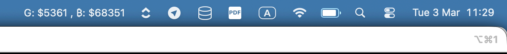

# Description
Tracking the Gold, BTC Price on Menu bar for MacOS

# Installation

1. Download and install [xbar](https://xbarapp.com/)
2. Access the plugin directory by right-click xbar on menu bar > open plugin folder
3. clone this repository or download gold.1m.sh to the plugin folder
> adjust refresh rate by rename script from .1m to 5m (5 minutes) or 10s (10second)
4. Give permission to script 
    - open terminal on plugin folder
    - run `chmod +x gold.1m.sh`
5. right-click xbar on menu bar click refresh 
